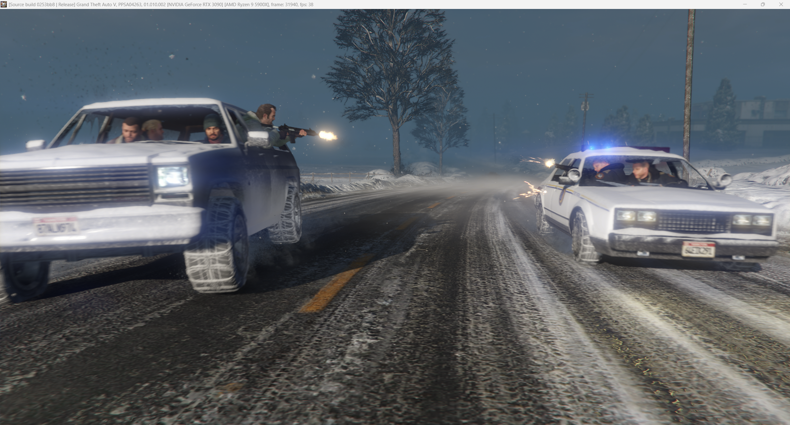
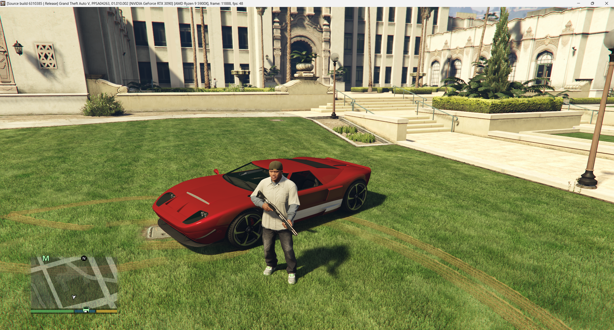

# KytyPS5-GTA

A fork of [KytyPS5](https://github.com/KytyPS5/KytyPS5) focused on running
**Grand Theft Auto V (PS5, PPSA04263)**.

This fork is always the latest upstream `main` plus a small set of fixes on top, one commit per
fix. Fixes that are useful beyond GTA V are proposed upstream as pull requests.

For everything about the emulator itself (features, system requirements, building, usage,
licensing), read the **[original KytyPS5 README](https://github.com/KytyPS5/KytyPS5#readme)**.

Builds of this fork for Windows, macOS and Linux are published on the
**[Releases](https://github.com/TheCruZ/KytyPS5-GTA/releases)** page (v1, v2, ...).

> [!IMPORTANT]
> KytyPS5 is not affiliated with Sony Interactive Entertainment, PlayStation or Rockstar Games.
> The project does not distribute games or copyrighted system software. Use only game files that
> you have obtained legally.

## Status

- Boots to the main menu and plays the prologue in Performance, Performance RT and Fidelity modes.
- The prologue can be completed and the game continues into Los Santos (Franklin and Lamar).
- Performance on an RTX 3090 / Ryzen 9 5900X in Performance mode, moving around Los Santos on foot,
  driving or flying: about 35 fps in the densest areas (occasional dips to about 27 fps in
  particular situations) and 45 fps or more everywhere else, at a steady 60 fps in much of it.
  It was about 12-13 fps before the GPU optimizations below.
- **Red zone protection** is enabled by default in this fork (disable it with `--no-redzone` or
  the "Windows SysV red zone crash protection" launcher option). Without it the game crashes in
  its streaming thread.

## Fork status

- 39 commits on top of upstream `main` (synced 2026-10-05).
- 🎉 11 fixes from this fork (three of them partly) are now part of upstream KytyPS5; 4 more were fixed
  there independently (see [Fixed upstream since the fork started](#fixed-upstream-since-the-fork-started)).

## Fixed bugs and crashes

Each item is one commit on top of upstream `main`.

### Crashes and unsupported shaders

- **Skinning compute shaders**: stores through buffer descriptors (V#) picked from a descriptor
  table on the GPU.
- **Ray-tracing buffers whose record count the shader computes** are bound instead of rejected
  (fallback for the counts upstream cannot read on the host).
- **V# bases selected by a scalar branch** in shaders that write memory.
- **Ray-hit shading shader (Fidelity/RT)**: GPU-indexed texture (T#) tables are bound as
  bindless sampled-image arrays (upstream now has the bounded material keys).
- **Fidelity mode exit "scalar resource reads overlap a shader buffer write"**: the BVH build
  shaders read a header word before they write it; such reads are accepted when they provably
  precede the dispatch's own writes (written compute descriptors are now read normally upstream).
- **"texture requires rediscovery before final acquisition"**: bindless table elements whose image
  an earlier rebind replaced are rediscovered before their views are acquired.
- **Crash when a gamepad is remapped** by SDL.
- **Missing letters in the boot legal notice and other text**: the compute shader that copies
  glyphs into the font atlas reads the CPU-rasterized bitmaps through DMA; memory without a cached
  buffer read as zero, so glyphs on those pages stayed blank. DMA base registers are now cached
  before the shader runs.
- **Crash at the car dealership (Franklin and Lamar)**: pixel shader `0xf6b18542ea0e938a` builds
  its sampler's border color word from lane data; the untrackable bits are now dropped (border
  color only) instead of failing the shader.
- **Streaming crash late in the prologue** ("[RAGE] HDD Streamer" in zlib `inflate_fast`): zlib
  keeps locals in the SysV red zone, which Windows overwrites when it delivers the exceptions the
  emulator's memory tracking raises. Red zone protection is now enabled by default.
- **Intermittent streaming crash** ("[RAGE] HDD Streamer" in zlib `inflate`/`inflate_fast`, about
  once every 100 sessions): the game maps the same direct-memory page again with `MAP_FIXED`
  while the streamer decompresses into it. The emulator replaces a mapping by unmapping and
  mapping it again, so for a moment the page was gone; guest accesses in that window now wait for
  the mapping and are retried.

### Shader instruction accuracy

- `V_CVT_PK_U16_U32` / `V_CVT_PK_I16_I32` saturate to 16 bits.
- `V_FRACT_F32` / `V_FRACT_F16` / `V_FRACT_F64` results stay below 1.0.
- All 64-bit integer `V_CMP` / `V_CMPX` compares (PR #1 by At0mC3, for PPSA04264).
- Float inline constants read by 64-bit operands use their double-precision encoding.
- Texel offsets of `IMAGE_SAMPLE*_O` are applied.
- Formatted stores convert to the unsigned 11/10-bit float formats.

### Rendering

- Render targets are no longer replaced with stale data after dispatches that may write through
  descriptor tables (the table's 41 MiB view covered the render-target pool).
- Stencil and depth-bias dynamic state is set for every draw (Vulkan validation errors).
- Page faults on pages that cache tracking protects outside the GPU-mapped ranges are resolved
  instead of reported as guest crashes.
- **Vehicle damage**: cars no longer deform wildly in collisions (wheels pushed outside the body,
  car unable to drive) and snap back later. The CPU reads the damage textures the GPU renders;
  GPU-written linear images are now read back to guest memory by default.
- **Ray tracing (Fidelity and Performance RT)**: GTA V's ray tracing dispatches run (BVH
  intersections are emulated in shaders on the GPU's regular shader cores) instead of being
  skipped, so ray-traced reflections and shadows are drawn (the scalar reads through GPU-selected
  V#s are now upstream).
- **Occlusion queries**: the game's occlusion counters come from real Vulkan occlusion queries
  instead of always reading visible (the sun's lens flare showed through trees and light glows
  through walls). Counters reach the game by the next frame, so water reflections (Michael's pool)
  no longer flicker.
- **Black smoke and particles**: smoke (Michael's cigar in Father/Son) and small particles render
  translucent instead of black. The game clears the particle depth target (R16 float) with a fast
  register clear that was ignored, so depth of field blurred the particles dark (decoding the
  16-bit clear values is now upstream).
- **Disappearing trees**: the trunks of nearby trees are drawn. GTA V tessellates them up close;
  its tessellation shaders now translate and tessellation is enabled by default (disable it with
  `--no-tessellation` or the launcher option).

### Performance

- Bindless tables: resolved elements are cached between dispatches and only re-resolved when
  their memory changes.
- Buffer device address synchronization only visits CPU-dirty pages and is skipped when nothing
  changed.
- Render-target fast clears whose metadata a compute shader filled no longer read the metadata
  back from the GPU.
- The Vulkan pipeline cache is kept across emulator builds and written periodically, so a crash
  does not lose it.
- RELEASE_MEM label writes no longer submit a command buffer each (about 200 submits per frame
  down to about 20).
- The per-draw render state is reused instead of zeroing 36 KiB per draw.
- Guest memory reads and range clamps on the GPU thread resolve their mapping without the global
  memory lock (per-thread caches validated by a mapping generation).
- Buffer device address synchronization only visits tracking regions dirtied since the last one.
- Shader resource tables are evaluated through a compiled node graph per resource plan (about
  3.8x faster than interpreting the IR on every draw).
- Shader stage lookup keys are built without per-word vector work.
- The emulated GPU runs as a pipeline of dedicated threads pinned to their own cores (command
  processor, draw resolution, execution and Vulkan recording) instead of one thread.
- Shader programs, resource tables and vertex fetch tables are resolved ahead of execution, and
  the shaders of a new area compile on six worker threads.
- Unmapping memory drains the GPU only when the range holds GPU data or a guest-memory
  completion is pending (it drained about 12 times per frame while streaming).
- Streaming no longer stalls frames for 80-280 ms: unmaps run ahead of the emulated GPU's
  backlog, and the guest memory map is updated and queried without linear scans or lock
  contention.
- Per-draw texture, render-target and image lookups are cached; deleted Vulkan images are
  recycled instead of reallocated.
- Indirect draws and indirect dispatches whose arguments the GPU writes (grass and foliage
  culling, ray tracing) run from those arguments on the host GPU instead of reading them back:
  the scene near the mountain went from about 34 to 60 fps.
- Reads and command-processor writes next to GPU-written data no longer drain the GPU, and
  GPU-written bytes are read back on a transfer queue that waits only for their last writer
  (Fidelity mode: about 5 to 8-9 fps).
- The Vulkan pipelines of earlier sessions are created on background threads while the game
  loads, so a new build no longer stalls on every new pipeline.
- **No more stutter the first time something is drawn**: the driver needs up to half a second
  to compile each new pipeline, and the game used to stop while it did (places seen for the
  first time dropped to about 18 fps). New pipelines are now compiled in the background and the
  draws that need them are skipped meanwhile, so an object may appear a moment late the first
  time it is seen while the game keeps running at 40-60 fps. Draws whose results the game reads
  back (memory writes, occlusion queries, vehicle damage) still wait. Disable it with
  `--no-async-pipelines` or the launcher option.

## Fixed upstream since the fork started

These problems no longer need a fork commit: KytyPS5 fixed them in its own `main`.

### Taken from this fork 🎉

Upstream commits co-authored by TheCruZ.

| Fix | Upstream commit |
|---|---|
| Fidelity mode device loss in the ray-tracing BVH build (the extra threads of a partial dispatch group stay inactive) | e4aca7a6, 0258bd61 |
| Unsupported `v_bfrev_b32` with an SDWA source (BVH build shaders) | d890bb19 |
| Ray-tracing buffers whose record count the shader computes | 8b05b673 |
| Single-DWORD and `FORMAT_X` loads through GPU-selected V#s | a55a2838, 5f01308b |
| Samplers built with `s_brev_b32` (constant-folded bit reverse) | 139b564c |
| `V_ALIGNBYTE_B32` uses only `S2[1:0]` as the byte offset | f18679e0 |
| Scalar reads through GPU-selected V#s (ray tracing) | b4d32394 |
| Written compute descriptors read without an alias proof | ec3e48cd |
| Partly: bounded material keys for the ray-hit material table | 843b5778, 1f6be3d5 |
| Partly: 16-bit color fast-clear values (black cigar smoke in Father/Son) | 57c97ebd |
| Partly: dynamic depth bounds, so deferred lights reuse their pipelines | 98401022 |

### Fixed by other upstream authors

| Fix | Upstream commit |
|---|---|
| Invalid depth upload on shadow cube maps (partial depth views) | 068d7621 |
| `DS_MIN_F32` / `DS_MAX_F32` operands | e85279ea |
| Formatted stores to SNORM and USCALED/SSCALED | de9c15fa |
| Synchronous CPU readbacks published on the waiting thread | 39e23ac9 |

## Known bugs and crashes

- **Occasional crash after switching to Fidelity mid-game**: changing the graphics mode in
  Settings from Performance to Fidelity sometimes exits with "MaterializeResources" shortly after.
  Loading a save that is already in Fidelity mode works.
- **First Fidelity session waits for shader compilation**: the first time ray tracing starts,
  the driver compiles its large ray tracing shaders (about 3-7 s each, 15-25 s in total). Later
  sessions create these pipelines while the game loads.
- **Ray tracing is slow**: Fidelity and Performance RT run at about 8-9 fps. The game issues
  about 1,140 compute dispatches per frame with ray tracing (about 45 without), and the emulated
  GPU's execution thread is the limit, not the host GPU.
- **Performance**: about 32 fps in the densest areas in Performance mode, with occasional dips to
  about 24 fps and short hitches while the game streams new areas. The execution thread of the
  emulated GPU is still the bottleneck (about 3,000-5,000 draws per frame).
- **Performance degrades during long sessions**: a place that runs at 60 fps right after loading
  the game can run at about 40 fps from the same camera angle after playing for a while (a
  mission elsewhere and back). Something accumulates over the session.

## Screenshots

## New prologue video with pipeline cache **empty** at 60 fps!!

- v6 compiles the shaders in background without freeze the image and show the models when they are ready, the game is running in 2k resolution

## 30 min gameplay video

## Reporting a problem

Open an issue with the crash message, the game mode (Performance, Performance RT or Fidelity) and
where in the game it happened. Crash reports from the emulator include the faulting thread,
registers and stack, which are usually enough to locate the problem.
